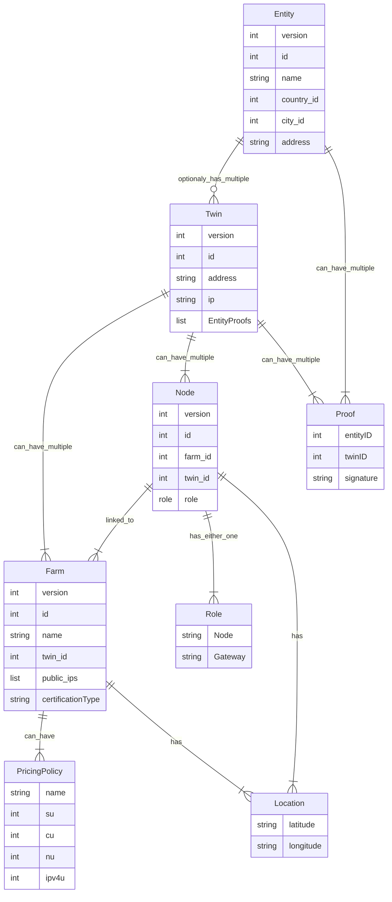

```mermaid
erDiagram
    Entity ||--o{ Twin : optionaly_has_multiple
    Entity {
        int version
        int id
        string name
        int country_id
        int city_id
        string address
    }
    Twin ||--|{ Farm : can_have_multiple
    Twin ||--|{ Node : can_have_multiple
    Twin {
        int version
        int id
        string address
        string ip
        list EntityProofs
    }
    Twin ||--|{ Proof : can_have_multiple
    Entity ||--|{ Proof : can_have_multiple
    Proof {
        int entityID
        int twinID
        string signature
    }
    Node ||--|{ Farm : linked_to
    Node ||--|{ Role : has_either_one
    Farm {
        int version
        int id
        string name
        int twin_id
        list public_ips
        string certificationType
    }
    Farm ||--|{ PricingPolicy : can_have
    Node {
        int version
        int id
        int farm_id
        int twin_id
        role role
    }
    Role {
        string Node
        string Gateway
    }
    PricingPolicy {
        string name
        int su
        int cu
        int nu
        int ipv4u
    }
    Location {
        string latitude
        string longitude
    }
    Farm ||--|{ Location : has
    Node ||--|{ Location : has
```